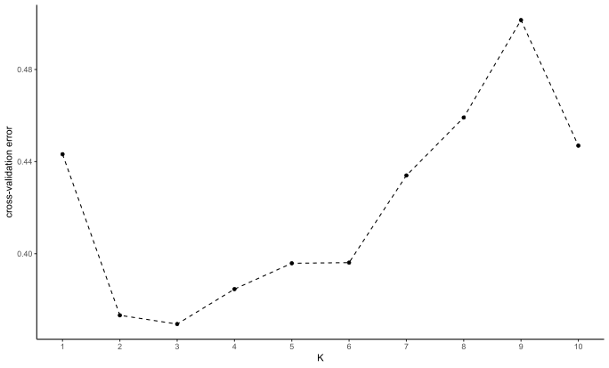
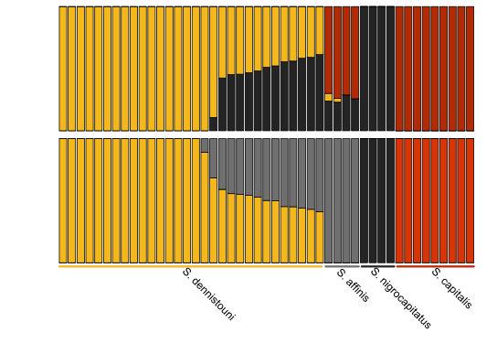
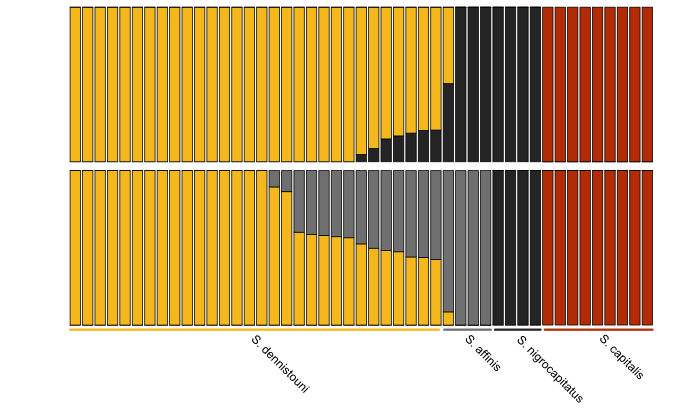
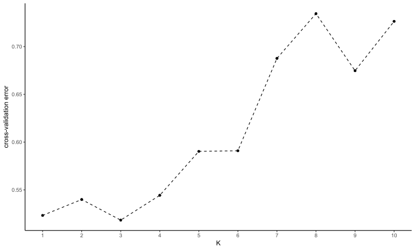
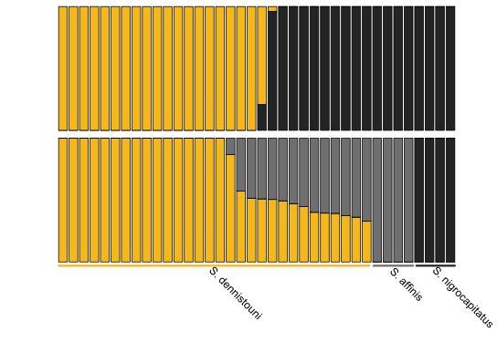
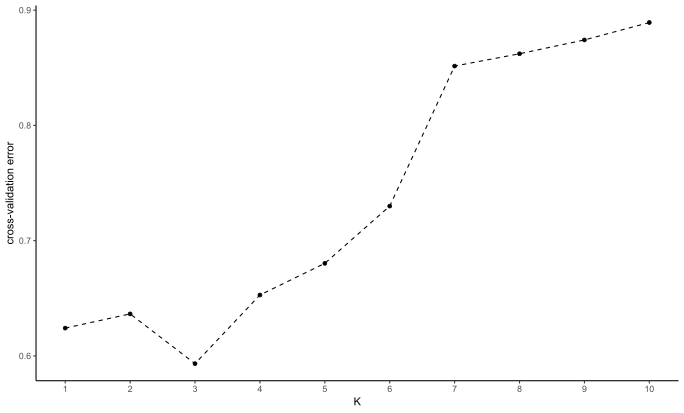
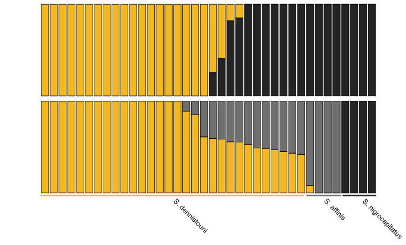
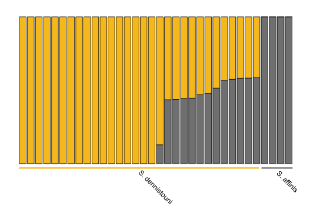

Running *ADMIXTURE*
================
Alexandra Files

I ran *ADMIXTURE* six times on this dataset (on the [linkage-filtered
vcf](../Data/Sterrhoptilus_thinned_vcf.gz)) by subsetting the
populations included and investigating whether singletons impacted
results for each subsetted dataset. I regularly found that singletons
prominently influenced results. Results found in the main body of the
manuscript are using all four *Sterrhoptilus* species and excluding
singletons.

For each of the six *ADMIXTURE* runs, I report the results in the
appropriate folder. R was then used to visualize the results. There are
three different scripts but they only vary in how to order and color the
data depending on which subsetted dataset it is. The same script can be
used for both singleton and non-singleton runs.

### Prepping vcf file for running *ADMIXTURE*

The script found [here](Sterrhoptilus_PrepforAdmixture.R) was used with
the outgroup-removed dataset found in the [data
folder](../Data/Sterrhoptilus_vcf_thinned.gz) to remove singletons,
linkage filter, and subset the data as necessary.

### *ADMIXTURE* on all four Sterrhoptilus species

*S. capitalis*, *S. nigrocapitatus*, *S. affinis*, and *S. dennistouni*
with singletons in [AdmixAllSpecies](AdmixAllSpecies) (4703 SNPs)

*S. capitalis*, *S. nigrocapitatus*, *S. affinis*, and *S. dennistouni*
without singletons in
[AdmixAllSpeciesNoSingletons](AdmixAllSpeciesNoSingletons) (3692 SNPs)

R script for visualizing the results with all four species is
[here](Sterrhoptilus_VisualizingAdmixture_AllSpecies.R)

### *ADMIXTURE* on three Sterrhoptilus species (excluding *S. capitalis*)

*S. nigrocapitatus*, *S. affinis*, and *S. dennistouni* with singletons
in [AdmixNoCapitalis](AdmixNoCapitalis) (3998 SNPs)

*S. nigrocapitatus*, *S. affinis*, and *S. dennistouni* without
singletons in
[AdmixNoCapitalisNoSingletons](AdmixNoCapitalisNoSingletons) (2975 SNPs)

R script for visualizing the results with three species is
[here](Sterrhoptilus_VisualizingAdmixture_NoCapitalis.R)

### *ADMIXTURE* on only *S. affinis* and *S. dennistouni*

*S. affinis* and *S. dennistouni* with singletons in
[AdmixOnlyDenandAff](AdmixOnlyDenandAff) (3502 SNPs)

*S. affinis* and *S. dennistouni* without singletons in
[AdmixOnlyDenandAffNoSingletons](AdmixOnlyDenandAffNoSingletons) (2601
SNPs)

R script for visualizing the results with only two species is
[here](Sterrhoptilus_VisualizingAdmixture_OnlyDenandAff.R)

### Generated one or two bar plots for each subsetted dataset

All 6 plots can be seen in the folder [AdmixturePlots](AdmixturePlots)

#### All four *Sterrhoptilus* species

|            Cross Validation Score with Singletons             |           Bar Plots with Singletons            |
|:-------------------------------------------------------------:|:----------------------------------------------:|
|  |  |

|                 Cross Validation Score without Singletons                 |                Bar Plots without Singletons                |
|:-------------------------------------------------------------------------:|:----------------------------------------------------------:|
|  |  |

#### Three *Sterrhoptilus* Species (excluding *S. capitalis*)

|             Cross Validation Score with Singletons             |            Bar Plots with Singletons            |
|:--------------------------------------------------------------:|:-----------------------------------------------:|
|  |  |

|                 Cross Validation Score without Singletons                  |                Bar Plots without Singletons                 |
|:--------------------------------------------------------------------------:|:-----------------------------------------------------------:|
|  |  |

#### Only *S. dennistouni* and *S. affinis*

|              Cross Validation Score with Singletons              |            Bar Plots with Singletons             |
|:----------------------------------------------------------------:|:------------------------------------------------:|
|  |  |

|                  Cross Validation Score without Singletons                   |                 Bar Plots without Singletons                 |
|:----------------------------------------------------------------------------:|:------------------------------------------------------------:|
|  |  |
