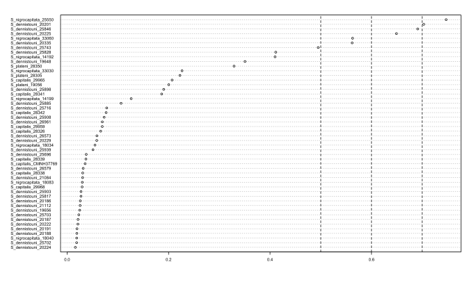

```{r setup, include=FALSE}
knitr::opts_chunk$set(collapse = TRUE, comment = "#>", echo = TRUE)
```

This folder contains all data needed to conduct the analyses in this repository. The raw Illumina sequence data will eventually be linked here (see manuscript for details of DNA extraction and library prep). In this folder, I have added the quality-controlled, filtered vcf [here](./Sterrhoptilus_vcf.gz) and the same vcf with a filter for SNPs within 500 base pairs of another [here](Sterrhoptilus_vcf_thinned.gz). This folder also includes a [sampling data csv](./Sterrhoptilus_SamplingData.csv) containing ID numbers, species, and locality for all the samples that passed quality control.

### SNP Quality Control and Filtering

#### Running the *Stacks* pipeline for *de novo* reference assembly

I demultiplexed the raw Illumina sequence data using *Stacks* process_radtags function, using these [barcodes](./Running_Stacks/Barcodes.txt). I then ran [Devon DeRaad's](https://github.com/DevonDeRaad) fastqcr Rmd [script](./Running_Stacks/fastqcr.Rmd) on the data to produce an [html document](./Running_Stacks/qc.html) with initial information on the quality of the reads per sample. This immediately informed me that I should drop all samples with less than 10% of reads than the median (13 samples in total).

I iterated over [m](./Running_Stacks/optimize.m.sh), [M](./Running_Stacks/optimize.bigm.sh), and [n](./Running_Stacks/optimize.n.sh), respectively to determine that the optimal parameters were [-m 4](./Running_Stacks/ParameterOptimization_m_Plot.svg) [-M 3](./Running_Stacks/ParameterOptimization_BigM_Plot.svg) and [-n 4](./Running_Stacks/ParameterOptimization_n_Plot.svg) (the asterisks denote the number of loci with 80% completeness, the red asterisk shows which value for that parameter retained the most loci). The vcf following *Stacks* parameter optimization before any filtering and quality control is called [n4.vcf.gz](./Running_Stacks/n4.vcf.gz).

#### SNP Filtering

I filtered the *Stacks* parameter optimized vcf file using Devon DeRaad's *SNPfiltR* package. I removed genotypes with read depths < 5, genotype quality < 35, and SNPs with a mean read depth > 125. I also removed heterozygous genotypes with 0.25 > allele balance > 0.75, and filtered for SNPs called in > 70% of samples ([script here](./QC_and_Filtering/Sterrhoptilus_SNPfiltering.R)). This script can be run to visualize many different plots to look at SNP quality and depth of coverage.

##### Proportion Missing per Sample


