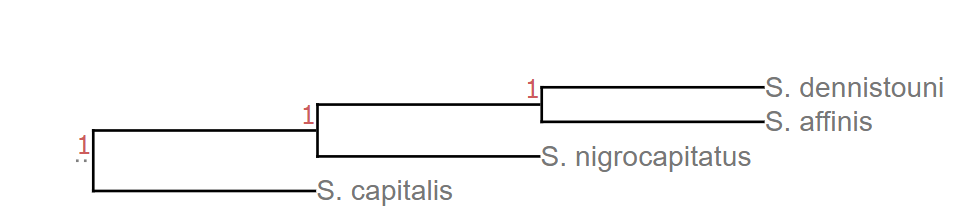
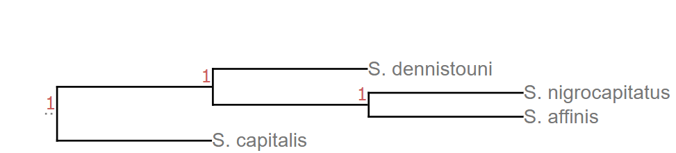
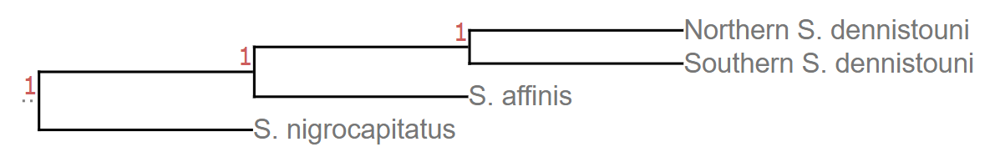

```{r setup, include=FALSE}
knitr::opts_chunk$set(collapse = TRUE, comment = "#>", echo = TRUE)
```

I ran Dsuite (Patterson's D statistic) three times to examine if there was an excess of shared alleles not due to incomplete lineage sorting using the [filtered vcf](../Data/Sterrhoptilus_vcf.gz).

### Testing for Shared Alleles between *S. nigrocapitatus* and *S. affinis*

I used [this tree](Dsuite_betweenAffinisandNigrocapitatus/nwk.tre.txt) (see below image) designating *S. capitalis* as the outgroup and making *S. affinis* sister to *S. dennistouni*, as supported by my [phylogenetic tree](../PhylogeneticTrees/Sterrhoptilus_PhylogeneticTree.svg).

I received a non-significant Patterson's D statistic of 0.09798, with a subsequent Z-score of 1.1569 yielding a p-value of 0.2473 (see the [resulting text files](./Dsuite_betweenAffinisandNigrocapitatus/stachyris.pops_affinis_hybrid_tree.txt).



### Testing for Shared Alleles between *S. affinis* and *S. dennistouni*

#### *S. dennistouni* as one population

I first tested for excess shared alleles between *S. dennistouni* and *S. affinis* by using all four species of *Sterrhoptilus*, and by setting *S. nigrocapitatus* and *S. affinis* as sister, despite the phylogenetic reconstruction not supporting this topology (see tree below). The results can be found in the folder titled [Dsuite_betweenDenandAff_CapasOutgroup](Dsuite_betweenDenandAff_CapasOutgroup/)

As expected, Dsuite found that the configuration with the most BBAA patterns was a tree where *S. dennistouni* and *S. affinis* was sister. To view the results with the forced tree below, the text file titled [stachyris.pops_all.samples_tree.txt](./Dsuite_betweenDenandAff_CapasOutgroup/stachyris.pops_all.samples_tree.txt) uses this tree to look for excessive shared alleles. I received a highly significant Patterson's D statistic of 0.64199, with a subsequent Z-score of 16.035 leading to a p-value < 0.0001, but this was expected since the guide tree was not supported by phylogenetic reconstructions.



#### *S. dennistouni* split into birds from putative hybrid zone and birds to the north of it

To better reflect the phylogenetic tree recovered, I split the *S. dennistouni* population into two: one consisting of all birds outside the putative hybrid zone and one consisting of all birds from Aurora (see [sampling map](../SamplingMap/Sterrhoptilus_SamplingMap.svg)). I used the below [tree](./Dsuite_betweenDenandAff_DenSplit/nwk.tre.txt).

I received a significant Patterson's D statistic of 0.210524, with a subsequent Z-score of 4.68472 yielding a p-value of 1.4017e-06 (see the [resulting text files](./Dsuite_betweenDenandAff_DenSplit/stachyris.pops_densplit_tree.txt)).


