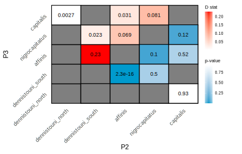

```{r setup, include=FALSE}
knitr::opts_chunk$set(collapse = TRUE, comment = "#>", echo = TRUE)
```

I ran *Dsuite* (Patterson's D statistic) to examine if there was an excess of shared alleles not attributed to incomplete lineage sorting using the [filtered vcf](../Data/Sterrhoptilus_vcf.gz). Although I specified a [guide tree](./DsuiteResults/nwk.tre.txt) that put *S. nigrocapitatus* and *S. capitalis* as sister, I used the [BBAA file](./DsuiteResults/Sterrhoptilus_Dsuite_popmap_all.samples_BBAA.txt) which means that trios of taxa are arranged to maximize BBAA pattern regardless of prior tree. Also because of this, some comparisons between taxa are not possible because some pairs of taxa will always be designated as P1 and P3 (and never P2) when adding a third taxa.

I used the ruby scripts provided with the [Dsuite tutorial](https://github.com/millanek/tutorials/tree/master/analysis_of_introgression_with_snp_data) to quickly plot results. I then used Devon's [plotting script](https://github.com/DevonDeRaad/nmel.ceyx/blob/main/dsuite/run.dsuite.qmd) with minimal changes to make a manuscript-quality figure.

I adjusted the critical value for my p-value to account for multiple tests using a [Bonferroni correction](https://doi.org/10.1080/01621459.1961.10482090) of 0.05/10 = 0.005.

##### Heatmap of Patterson's D statistic and associated p-values


