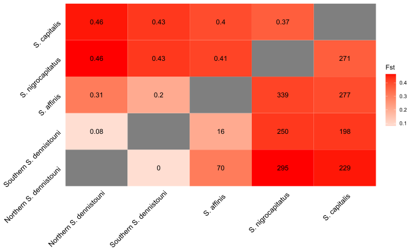

```{r setup, include=FALSE}
knitr::opts_chunk$set(collapse = TRUE, comment = "#>", echo = TRUE)
```

I calculated Fst values and fixed differences between each population of *Sterrhoptilus* using this [script](Sterrhoptilus_FstandFixedDifferencesMatrix.R). I split *S. dennistouni* into Northern and Southern populations by denoting all individuals from the putative hybrid zone as "Southern" and all other birds as "Northern" (see [sampling map](../SamplingMap/Sterrhoptilus_SamplingMap.svg)).  


