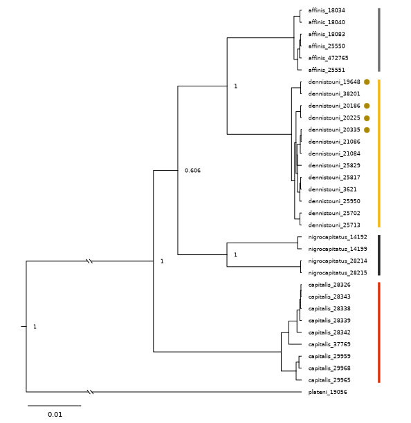
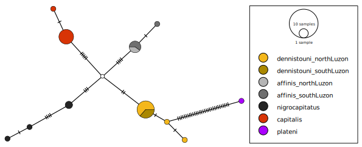

Mitochondrial Data
================
Alexandra Files

### Data

I downloaded the mitochondrial data as a single [fasta
file](./mitochondrial_rawdata.fasta) of 32 *Sterrhoptilus* specimens and
1 *D. plateni* (outgroup) sequenced by [Hosner et
al. 2018](https://doi.org/10.1007/s10592-018-1085-4). I made an aligned
nexus file by using the ClustalOmega Multiple Sequence Alignment [web
service](https://www.ebi.ac.uk/jdispatcher/msa/clustalo). Using the
supplementary material in Hosner et al. 2018, I identified *S.
nigrocapitata* as either *S. nigrocaptiatus* or *S. affinis* and fixed
the names in the nexus file to produce
[mitochondrial_aln.nexus](./mitochondrial_aln.nexus).

### Mitochondrial Phylogenetic Tree

I prepared an [.xml file](./mitochondrial_data.xml) for input into
*BEAST* using *BEAUti*, using the “Standard” template and specifying an
HKY model of DNA evolution, strict clock model, and birth-death tree
prior as Hosner et al. 2018 performed. I ran the MCMC for 50,000,000
generations (sampled every 50,000), creating [.trees
file](./mitochondrial.trees) and used *TreeAnnotator*, removing the
first 10% of runs as burn-in, to make a [maximum clade credibility
tree](./mitochondrial_ML.tree). I visualized this tree with *FigTree*.

<figure>

<figcaption aria-hidden="true">Mitochondrial Tree Rooted on <em>D.
plateni</em> visualized with <em>FigTree</em>. Dirty yellow dots by four
<em>S. dennistouni</em> are individuals from the putative hybrid
zone.</figcaption>
</figure>

### Haplotype Network

Using the aligned nexus file, I made a TCS haplotype network using
*PopART*.

<figure>

<figcaption aria-hidden="true">Mitochondrial Haplotype
Network</figcaption>
</figure>
