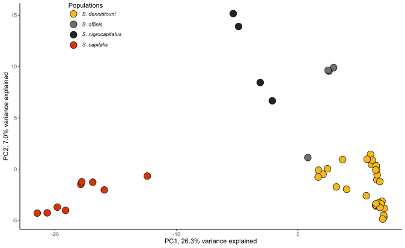

```{r setup, include=FALSE}
knitr::opts_chunk$set(collapse = TRUE, comment = "#>", echo = TRUE)
```

This folder contains the [PCA script](Sterrhoptilus_PCAplot.R) used with [non-linkage filtered vcf file](../Data/Sterrhoptilus_vcf.gz) to produce the below plot.

PC1 explained 26.3% and PC2 explained 7.0% of differences.


