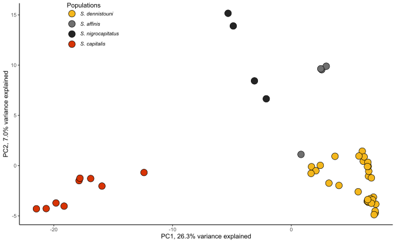

Making the PCA
================
Alexandra Files

This folder contains the [PCA script](Sterrhoptilus_PCAplot.R) used with
[non-linkage filtered vcf file](../Data/Sterrhoptilus_vcf.gz) to produce
the below plot.

PC1 explained 26.3% and PC2 explained 7.0% of differences.

<figure>

<figcaption aria-hidden="true">PCA Plot</figcaption>
</figure>
