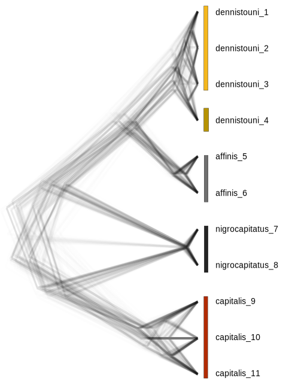
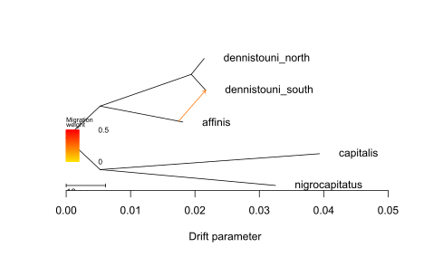
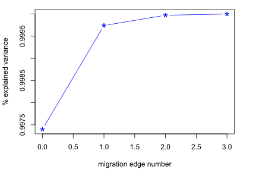
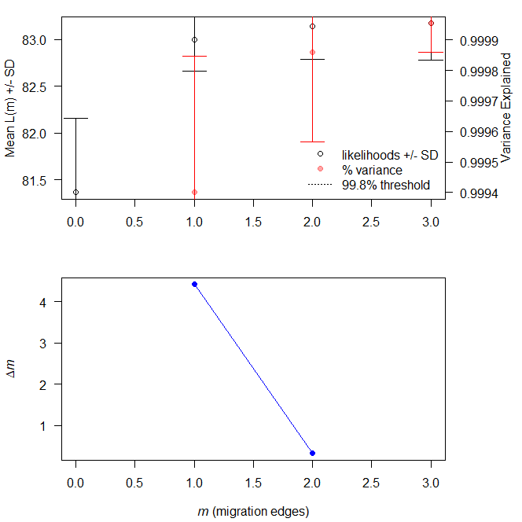
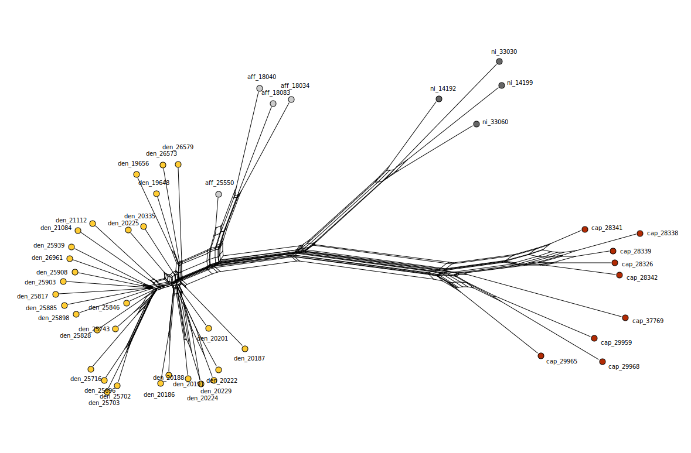

Phylogenetic Trees for *Sterrhoptilus*
================
Alexandra Files

This folder contains all files and results from running *IQTree*,
*SNAPP*, and *TreeMix* to make a phylogenetic trees and an unrooted
phylogenetic network using *SplitsTree*.

### IQTree

The folder [IQTree](IQTree) contains the bash script for running
*IQTree* and all the subsequent results. I generated
[pops.phy](./IQTree/pops.phy) file for input into *IQTree* with
*Stack’s* population model with [whitelist.txt](./IQTree/whitelist.txt)
(containing all locus names) and
[iqtree.popmap.txt](./IQTree/iqtree.popmap.txt) (containing all samples)
files. I performed 1000 ultra-fast bootstrap replicates and had IQTree
select the best AIC tree.

I visualized [pops.phy.treefile](./IQTree/pops.phy.treefile) with
*FigTree*, rooted on the outgroup *D. plateni*.

##### Phylogenetic Tree Rooted on *D. plateni* visualized with *FigTree*

### SNAPP

I randomly subsampled my data to have at least two individuals from each
locality five separate times, using the [Preparation for Snapp
script](./SNAPP/Sterrhoptilus_PreparationforSnappTree.R). This resulted
in five nexus files, with random subsampling of the data that can be
found in the [SNAPP folder](./SNAPP). I manually changed the nexus
datatype from “DNA” to “SNP”. For each nexus file, I used *BEAUti* to
make .xml files for input into *BEAST*, using the default *SNAPP*
template (excluding non-polymorphic sites) that ran for an MCMC chain
length of 5 million with trees logged every 1000 steps. All sampling,
nexus, xml, and output tree files for each run can be found in the
[SNAPP folder](./SNAPP) under the respective run number.

All species trees converged on the same topology, the combined consensus
trees from all 5 runs are shown below. With the exception of two
parameters from the third run of *SNAPP*, all parameters are well over
the effective sample size threshold of 200, with the majority of the
parameters with ESSs over 1000.

##### Consensus Trees from 5 Independent *SNAPP* Runs

### TreeMix

I used the [linkage filtered
dataset](../Data/Sterrhoptilus_thinned.vcf.gz) to explore adding
migration edges to the phylogenetic tree. I first removed *D. plateni*
and designated birds from the hybrid zone as “dennistouni_south” in my
[popmap file](./TreeMix/treemix_popmap_nooutgroup.txt). I added between
1-3 migration edges (3+ migration edges failed to find possible edges to
add) and performed each analysis 5 times, rooting on *S. capitalis*. I
ran *TreeMix* with 0 added migration edges only once.

Using the script
[Sterrhoptilus_TreeMix](./TreeMix/Sterrhoptilus_TreeMix.R), I plotted my
results, relying on the [plotting_funcs
script](./TreeMix/plotting_funcs.R) provided with the *TreeMix* program.
To assess which model best fit the data I looked at percent variance
explained by each model. The tree with 0 migration edges explained
99.74% of the data, following short of the 99.8% threshold by [Pickrell
and Pitchard, 2012](https://doi.org/10.1371/journal.pgen.1002967).
Adding one migration edge brought the % explained variance to 99.97%.
Using the r package *OptM* “linear method”, all change points for the
different models were estimated around 1 added edge.

In order to use the “Evanno” method in *OptM*, I needed to subset my
linkage-filtered vcf to introduce more variation in likelihood
estimations. I did this by splitting the 5341 SNPs equally into 5 vcfs
of 1068 SNPs. The “Evanno” method suggested that delta m increased at 1
migration edge and even larger at 2, although the changes between delta
ms were slight (see below figure).

##### *TreeMix* trees with one and two migration edges

##### Percent variance explained by adding migration edges

##### Subsetted dataset “Evanno” method for delta m

### SplitsTree

I prepared the vcf file for *SplitsTree* by editing sample names and
making a pairwise divergence matrix using the script
[Sterrhoptilus_PreparationforSplitsTree](Sterrhoptilus_PreparationforSplitsTree.R),
generating the [input text file](Sterrhoptilus_DivergenceMatrix.txt) for
visualization in *SplitsTree*.

##### Unrooted Phylogenetic Network Visualized with *SplitsTree*

