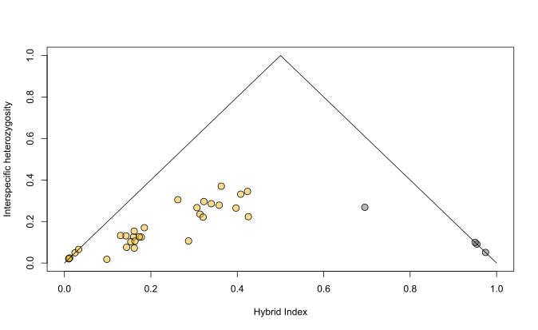
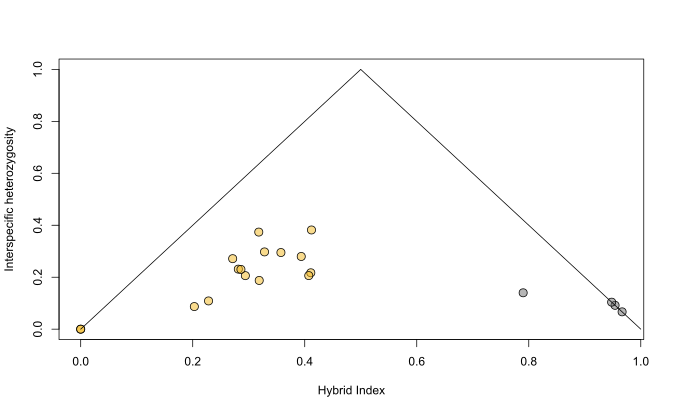

```{r setup, include=FALSE}
knitr::opts_chunk$set(collapse = TRUE, comment = "#>", echo = TRUE)
```

This folder contains two scripts that make different triangle plots depending on the inclusion or exclusion of the most northern *S. dennistouni*.

### Using *S. dennistouni* from northern Luzon as a parental population

The script titled [Sterrhoptilus_TrianglePlot_FarNorthernDen](Sterrhoptilus_TrianglePlot_FarNorthernDen.R) calculates the *S. dennistouni* parental population by using five *S. dennistouni* from the farthest northwest locality (see the [sampling map](link_here)). In total, using a SNP completeness cutoff of 0.8, 214 fixed SNPs were found to calculate the hybrid index and interspecific heterozygosity.



### Using *S. dennistouni* from just outside putativ hybrid zone as a parental population

The script titled [Sterrhoptilus_TrianglePlot_SlightlyNorthDen](Sterrhoptilus_TrianglePlot_SlightlyNorthDen.R) calculates the *S. dennistouni* parental population by using two *S. dennistouni* from slightly north and outside of the putative hybrid zone (see the [sampling map](link_here)). This found 213 fixed SNPs (SNP completeness of > 0.8) to make the triangle plot.


