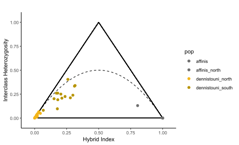

```{r setup, include=FALSE}
knitr::opts_chunk$set(collapse = TRUE, comment = "#>", echo = TRUE)
```

This folder contains the [script](./Sterrhoptilus_TrianglePlot.R) to use [Ben Wien's triangulaR](https://github.com/omys-omics/triangulaR) R package that generates the below plots. 

The [popmap](./Sterrhoptilus_popmap.txt) designates all *S. dennistouni* from the putative hybrid zone as "dennistouni_south", and all other *S. dennistouni*, used as the other parental population, are "dennistouni_north". The single *S. affinis* gathered further north of the other *S. affinis* is called "affinis_north" and was not used when calculating the differences between parental populations.

##### 70% Completeness (217 SNPs)


##### 80% Completeness (163 SNPs)


##### 90% Completeness (106 SNPs)



##### 100% Completeness (74 SNPs)


